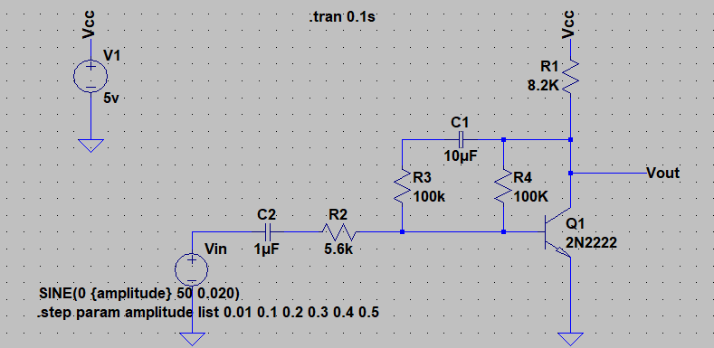
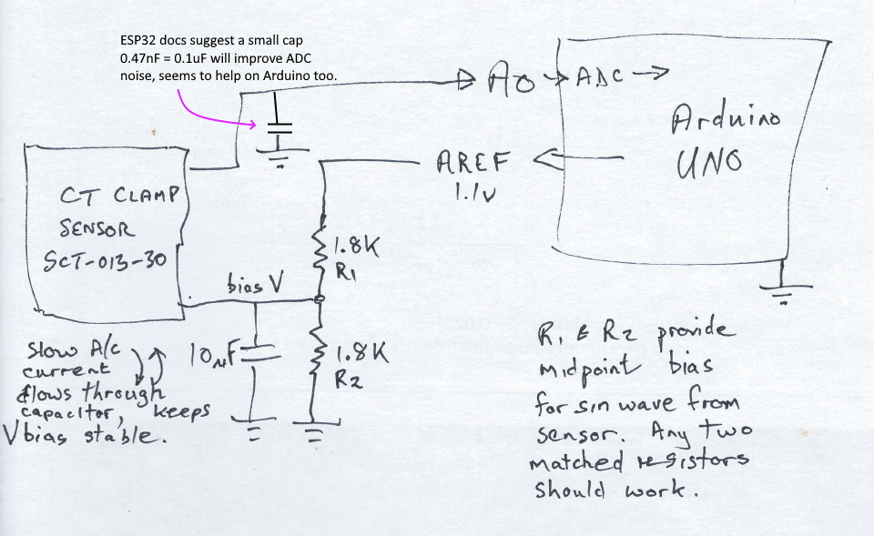
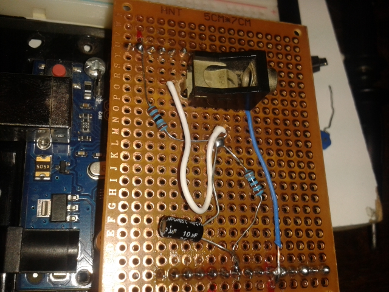
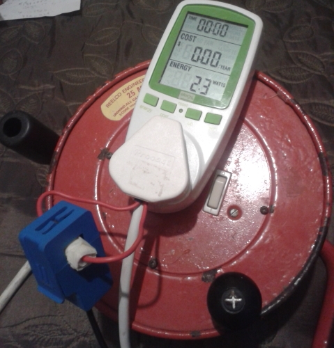

# Yet Another Energy Monitor

##  Sensing, and making sense of a CT Clamp SCT-013-030

The current sensing clamp I have is a Banggood device, 
http://statics3.seeedstudio.com/assets/file/bazaar/product/101990028-SCT-013-030-Datasheet.pdf 

If we believe these device specs (I am somewhat skeptical), the response is
1V per 30Amps.  Is this 1V peak-to-peak, Amplitude, Average, or RMS?  

Rather than start from the comprehensive resources at 
https://openenergymonitor.org/forum-archive/node/225.html,
it seemed like an interesting idea to try to figure things out "from scratch".  If
nothing else, this approach will allow me to better appreciate how others have 
tackled this problem in the past. 

After a first look I thought 

1. The clamp is less sensitive than the specs tell.  Based on my tests 
in the next section, I estimate sensitivity at 19.5mV per amp, so 30 amps
will produce 583mv RMS rather than 1V.  The upside is we could probably measure more mains current.

2. Small A/C signals have some pitfalls for this kind of DIY project. A sensible approach would
be to amplify the sensor output through an op-amp with high input impedance, making it easier to
deal with.   But one would need an opamp, and a dual rail power supply (say +5V, -5V).  And that
doesn't seem to fit the spirit of a DIY project based around an ESP-32 or an Arduino.  

3. The signal is not an arbitrary A/C signal with high frequencies. 
It is the output induced by
a 50Hz or 60Hz mains sine wave.  This low frequency wave is hugely to our advantage. 
Much of the
AC amplifier theory is based on handling high frequencies and 
faithful waveform amplification.  Neither is important here.   

4.  I need to set some limits of what I am trying to do.  How little 
current should I be able to sense?  How much?  At what resolution?   


My medium value load is a domestic oil heater with two separately switched elements, nominally 1000w and 1500w at 220v. 
To this I could add other domestic resistive loads: a toaster, or a clothes iron. 
My mains is 240V, 50 Hz. 

My low power load is a 20 Watt incandescent lamp.  I measured the resistance, 
but whoa, I learned something interesting!  My calculations said it would consume 
more than 200Watts.  Turns out this is not so.  Tungsten filaments increase their 
resistance as they get hot. So, in this case, "Resistance is Futile". 
https://www.wired.com/story/need-an-ohms-law-party-trick-take-a-lightbulbs-temperature/


* 20W bulb:                  
* elem1:  1000w nominal, r1=46.7 ohms measured resistive load.  
* elem2:  1500w nominal, r2=28.6 ohms measured resistive load.  
* both :  2500w nominal, rb=17.8 ohms measured resistive load.

The theory says we should have r = r1.r2/(r1+r2) = 17.73 ohms. Close enough!  
So my real power at 240V RMS mains in each element is V*V / R

* elem1 = 1233W
* elem2 = 2014W
* both  = 3235W  ?? 

 
 current   rms reading    Amplitude   RMS=.707xA  

| Load   | Expected | DMM AC |  Scope Amplitude    | RMS calc  
| ------ | -------- | ------------- | --------- | ----------  
lamp 20W  |          | 1.5mV 
lamp 60W  |         | 5.0mV
elem1    | 5.14A   |  112 mV       |    156mV    |    110mV     
elem2    | 8.39A   |  176 mV       |    250mV    |   177mV    
both     | 13.53A   |  271 mV       |    388mV   |   274mV       


My house wiring and my extension leads have some additional 
supply resistance. The 240V voltage in the house falls off considerably
under high load, (I can see lights dim momentarily as a heavy load kicks in) 
which accounts for the fact that both elements on together use a bit less than the
sum of each one on independently.   


## Strategy

I took a wrong turn, believing I needed to amplify the voltage from my sensor.  So
I dug a little into single transistor Common Emitter Amplifier design.  I didn't think I needed to
preserve both halves of the A/C cycle, so I deliberately mis-biased the transistor
to clip one half of the wave, in a trade-off that gave me more gain for the other
half of the wave.  With some theory from https://www.nutsvolts.com/magazine/article/bipolar_transistor_cookbook_part_3 (Figure 15) 
and some modelling help from LTSpice, I modelled and built this amplifier:  It inverts its
input signal, but that shouldn't bother our attempt to find peaks or areas under the one half of the curve.    



The specific transistor Q1 could be substituted by any small signal NPN transistor.  Capacitor C1 blocks
DC feedback to the transitor base.  At 50Hz you can substitute a wide range of values and it will work
just fine.   

Of course an OpAmp-based amplifier might have been easier, but I didn't have a rail-to-rail 
opamp to play with, didn't want to use dual-rail power, and I don't have enough opamp expertise 
to know if I'd be able to clip one half of the signal.

The output shows the Vin voltage from the sensor, (white, ranging over 6 different amplitudes), 
and the green is the amplified output, with some clipping on one half of the sin wave.   


I thought the initial dip in the green V(vout) at 20ms was important: it assures us that 
we're still in the active region of the transistor for small positive inputs, 
before we clip.  In other words, we're amplifiying a small portion of the positive 
half of the white wave before clipping, but all of the negative half of the white wave. 

In practice, determining exactly where the zero A/C volt line is (about 0.9V on the amplifier) 
gave me trouble, and led to some inaccuracies. 


## Keep It Simpler: Version 2!

Then a friend visited and said "Do you know what AREF and analogReference()
do on the Arduino?".  So suddenly I could adjust the ADC scale and sensitivity 
to match the signal, rather than amplify the signal to match a fixed-scale ADC. The 
internal 1.1V reference gave an ADC scale that was ideal to measure output
from a sensor that was producing 1V.  The 1.1V reference voltage 
is also exposed on the AREF pin on the Arduino.   

The amplifier I had built was history.  Here is the new Version 2 
circuit:  Two resistors voltage-divide the AREF in half, and that becomes the 
bias for one end of the current clamp.  A capacitor gives the 
AC current in the sensor a path to ground (other than allowing it to 
travel solely through my biasing resistors, which messes with the bias).



## Build It!  

After a trial-run on a breadboard, I soldered up my own shield.  The female 
connector for the mini-jack plug on the sensor was scavanged from an old AT 
motherboard.  



There is a fair amount of electrical noise in my workspace.  I got noticable 
reductions in the noise (sampled by the software) by detaching my 
diagnostic tools, and by keeping the leads short. Hence the reason for soldering
what was needed onto the shield.  

## Software Goals

I was building this to experiment and learn a bit about power monitoring.  
I wanted to investigate questions like 
* Can I guess power more accurately
by looking at peaks on the sine wave, or should I try to 
integrate area under the two halves of the wave?  
* Can I determine the 
peak positions, or the zero crossing points reasonably accurately?  
* If I also monitor voltage, can I tell if and by how much the current sensor is
phase-shifted from my voltage wave?
* Is my ADC conversion and the CT clamp that produces the voltages
  relatively linear or do I need to cater for some non-linearity?
* Is the accuracy of the mains frequency and the accuracy of the Arduino
  clock good enough so that we can sample the wave based on Arduino timing?
* Can I provide for some user-controllable input to tweak things on the fly? 
  For example, show more debugging information, or show the raw readings.  

## The main sketch

  I tend to organize my main loop in "polling" style like that used in Microsoft's 
  XNA gaming framework.   
  
  Rather than relying on interrupts 
  and timing delays to coordinate things, the 
  main loop gets the current time from the processor, and compares it to the time at 
  which the next events should happen.  In this case, our key event is "take a new 
  sample of the ADC voltage" (or voltages, if we're monitoring both the CT Clamp 
  output and the mains voltage, and other sensor voltages). 
  
  The approach works nicely on systems of different speeds,
  and makes it easy to add new functionality, e.g. update the display once a
  second, or log the results to an SD card every minute, or sample the 
  room temperature once every five minutes.  

  So the main program is organized something like this: (The real 
  code might be a bit messier, but follows these ideas...)

  ```
const int mainsFrequency = 50;
const int numSamplesPerCycle = 100;  // Samples to take per mains A/C cycle.
long timeBetweenClampSamples = 
           (long) ((1000000.0 / mainsFrequency) / numSamplesPerCycle);
long nextSampleDue = 0;        // The timing is in microsecs

bool rawMode = false;          // Don't analyze - just show raw ADC readings.

// Set this to the midpoint of the ADC sample range for your hardware.
const int zeroReadingGuess = 510;
WaveIntegrator theIntegrator(numSamplesPerCycle, zeroReadingGuess);

...

void loop() {

    long timeNow = micros();

    if (timeNow >= nextSampleDue) {

       nextSampleDue += timeBetweenClampSamples;
       int val = analogRead(A0);
       if (rawMode) {
          Serial.println(val);
       }
       else { 
           bool cycleComplete = theIntegrator.addReading(val);
           if (cycleComplete) {
               ... more logic to accumulate info from this cycle
               ... if we've had enough cycles for the next report
                   ... output our latest report and reset things.
           }
    }

    processInputFromUser();
}
```

So the key ideas are that main loop timing determines when to take a sample.  Samples
are integrated / analyzed as they occur. The analyzer knows how many
samples to expect for each mains cycle, and returns a boolean 
telling us that the mains cycle is complete, we can use the data.

The result of each cycle is accumulated until the next report is due, and
at that time averages are computed and reported. 


Processing single-character user input lets us fiddle with reporting styles
and frequency, and a few other things.

```
void processInputFromUser()
{
  int n;
  if (Serial.available() > 0) {
    n = Serial.read();
    switch (n) {
      case '?': case 'h': showHelp();  break;
      case 'r': rawMode = !rawMode;  break;
      case 'x': extraInfo = !extraInfo; break;
      case '0': reportingStyle = 0;  break;
      case '1': reportingStyle = 1;  break;
      case '2': reportingStyle = 2;  break;
      ...
    }
  }
}
```

## The WaveIntegrator

This sums up (and finds peaks) over all the ADC samples in one mains cycle.   

A key issue is to know `zeroVal` - the ADC sample reading we get at 0V.
So if our biasing resistors are giving us readings of, say, 511 
when no current is present, 
a reading of 611 represents 100 units positive, while a reading of 411
represents a hunded units negative.  

We dynamically adjust `zeroVal` on the assumption that 
the negative and positive halves of the cycle should have balanced sums. We 
store `zeroVal` (and all other accumulators) as double values. So even though the 
raw ADC readings might oscillate a bit from noise 510, 511, 511, 512, 512 ...
we'll have an average, slow-learning `zeroVal` that keeps that zero point as 
accurate as we can get it. Better accuracy here allows us to detect smaller  
currents above the inherent noise level.

During one mains cycle with perhaps 100 sample points, 
the logic is pretty simple:  subtract `zeroVal` from the sample, determine
if we're in the positive or negative half of the wave, test and remember
new peaks in each half, and accumulate the value into a separate 
sum for each half. 

Also count the number of samples and when a complete wave has been processed, 
do some internal rebalancing of `zeroVal` and combine the two halves into 
a single positive measure of "area under both halves of the sin wave".

It is not necessary to synchronize mains cycle sample processing
to the mains crossing point - in a 50 cycle situation, any seriers of 
readings over 20ms should tell us everything we need to know. 


```
class WaveIntegrator
{
  private:

    int readingsInCycle;     // determined by main program
    int numReadingsToGo;     // counts down. 0 when the A/C cycle is complete.

  public:

    double zeroVal;           // estimate of ADC reading when no A/C wave is present.
    double highHalf;          // sum of each  (ADC - zeroVal) which is positive
    double lowHalf;           // sum of each  (ADC - zeroVal) which is negative
    double bothHalves;        // combined halves with balancing, set at end of cycle
    double highPeak;          // max of (ADC - zeroVal), should be a positive value
    double lowPeak;           // min of (ADC - zeroVal), should be a negative value

  private:
    void reset() {
      highHalf = 0;
      lowHalf = 0;
      highPeak = 0;
      lowPeak = 0;
      numReadingsToGo = readingsInCycle;
    }

  public:

    WaveIntegrator(int readingsPerCycle, int initialZeroVal)
    { readingsInCycle = readingsPerCycle;
      zeroVal = initialZeroVal;
    }

    bool addReading(int val) {

      if (numReadingsToGo <= 0) reset();
 
      val = val - zeroVal;
      if (val > 0) {
        highHalf += val;
        if (val > highPeak) {
          highPeak = val;
        }
      }
      else if (val < 0) {   // process the negative half of the sine wave
        lowHalf += val;
        if (val < lowPeak) {
          lowPeak = val;
        }
      }

      if (--numReadingsToGo <= 0) {  // Don't clear values until the caller has seen them.

        bothHalves = highHalf - lowHalf;    // Sum of two halves of the wave.

        // If zeroValue is slightly off, the low and high sums over the
        // cycle become unbalanced.  Ideally, highHalf + lowHalf == 0.
        // Any difference is an error component or noise.

        double err = highHalf + lowHalf;
        // Slowly drift our zeroVal in respose to the errors we see.
        // This should let the system learn the midpoint dynamically.
        zeroVal += (err / readingsInCycle) * 0.01;
        
        return true;
      }
      return false;  // no results for this cycle yet.
    }
};
```

It is easy to keep track of where the peaks occur, so if we did need to know phase
of the wave or expected time of zero crossing, we can add this.

## A bit more detail for the main loop

We showed above how the main loop waits for an event time to come due, then 
reads the ADC and passes the value to the integrator.  At the end if 
each mains cycle the caller can use the accumlated data.  So we sum it up.
When a predetermined number of mains cycles have elapsed, we trigger a
report that gives averages over the past batch of cycles.   

We make use of a utility, discussed below, to convert our "integrator average 
readings" to watts.  Here is a bit more detail from the main loop:

```
bool cycleComplete = theIntegrator.addReading(val);

if (cycleComplete) {

    sumOfBothHalves += theIntegrator.bothHalves;

    // more diagnostic stuff:
    sumOfHighHalf += theIntegrator.highHalf;
    sumOfLowHalf += theIntegrator.lowHalf;

    if (--cyclesUntilNextReport <= 0) {

        cyclesUntilNextReport = cyclesBetweenReports[reportingIndex];

        double waveArea = sumOfBothHalves / numSamplesPerCycle / cyclesUntilNextReport;

        double highHalfAvg = sumOfHighHalf / numSamplesPerCycle / cyclesUntilNextReport;
         double lowHalfAvg =  sumOfLowHalf / numSamplesPerCycle / cyclesUntilNextReport;
        
        char watts[15];
        dtostrf(toWatts(waveArea), 7, 3, watts);

        resetForNextCycle();

        switch (reportingStyle) {
        ...
        case 2:
          sayf("waveArea: %f --> %s Watts\n",  waveArea, watts);
          break;
        case 3:
          sayf("two halves: %f %f (lopsided by %f) zeroVal=%0.4f   waveArea=%f --> %s Watts\n",
            lowHalfAvg, highHalfAvg, lowHalfAvg + highHalfAvg, theIntegrator.zeroVal, waveArea, watts );
              break;
          }
        }
      }

```

The `sayf` function is a minimal home-wriiten version of printf that can also format doubles.  

The important mapping here is `toWatts()` that convers the integral sum value into watts. 


## Calibration and Conversions

The "magic numbers" that come out of the integrator must be converted to different units - Watts -
to make sense.  

If that conversion is assumed to be a straight-line (linear) mapping, just two reference points
are required: `(Xi,Yi)` where `Xi` is the reading from the software, and `Yi` is the
corresponding wattage value.   The straight-line mapping is then a formula `f(x)=a+bx`.  All we need
are to solve for `a` and `b` are two points on the line.

If we assume some non-linear effects (the ADC on one of my ESP32 processors seems to read low near 
its middle-of-scale) then a better conversion occurs if we have many `(Xi,Yi)` points in a lookup
table. The assumption is then that the conversion is represented by a straight line between
its two closest points.

```

const int numRefPts = 20;  // each x,y takes two slots in the array
const double xs[numRefPts] =  {
  // reading -> watts
  -0.001,   2.2,     // dummy first table entry, estimated
  0.4,      2.3,
  1.39,    11.7,
  2.88,    28,
  4.71,    54.7,
  5.43,    62.6,
  101.22, 1028,
  180,    1750,
  280,    2750,
  2800,  27500    // dummy last table entry, estimated
};


double toWatts(double x) 
{  
   int p = 2;
   while (xs[p] <= x) p+=2;  // find first position of even p so that xs[p] is bigger than x.
   // The value we want lies between indexes p-2 and p in our table.   So interpolate.
   double f = (double)(x-xs[p-2]) / (double)(xs[p]-xs[p-2]);     // 0 <= f < 1
   double result = xs[p-1] + f * (xs[p+1]-xs[p-1]);

   return result;
}
```

My table is not necessarily accurate for your situation.  A friend lent me an Efergy
Energy Monitor with a claimed accuracy of 2%.  I had some small reservations that the
monitor showed 2.3 Watts of consumption even when nothing was plugged in (is this its 
own parasitic consumption?).  But for the purposes of this project my goal was "get the
software output as close as possible to the Efergy readings.  




So an exercise followed where I plugged in lamps, heaters, heat-adjustable soldering irons,
etc. in various combinations, and recorded various `(Xi,Yi)` points.  Once observation is
that the readings are not very stable, nor repeatable.  The same heater element will often 
show up to 50 watts different consumption on another day.  

If you have 120V mains, these table entries are likely out by a factor of two. 

## Calibration and Conversions, Part 2

In the spirit of "an experimental workbench", I wondered whether a straight-line 
best fit (rather than the more complex linear interpolation) would be easier.
I coded up the steps at 
https://www.varsitytutors.com/hotmath/hotmath_help/topics/line-of-best-fit
to find the best fit approximation, and ran it on the values in the table above.
It puts the best-fit line as (m is slope, b is intercept)
```
Calculated m = 9.80, b=5.41
```
Its not a great approximation at low values, but once we get above about 40 watts 
the straight line algorithm (values in parentheses below) is 
adequately close to the more complex linear interpolation method.
```

waveArea: 0.25 --> 2.26 Watts (or 7.84 Watts)
waveArea: 2.11 --> 19.53 Watts (or 26.04 Watts)
waveArea: 4.20 --> 47.23 Watts (or 46.54 Watts)
waveArea: 5.28 --> 60.99 Watts (or 57.18 Watts)
waveArea: 5.33 --> 61.45 Watts (or 57.58 Watts)
waveArea: 44.85 --> 459.84 Watts (or 444.81 Watts)
waveArea: 48.13 --> 492.99 Watts (or 477.04 Watts)
waveArea: 65.10 --> 663.95 Watts (or 643.25 Watts)
waveArea: 77.94 --> 793.42 Watts (or 769.12 Watts)
waveArea: 95.26 --> 967.96 Watts (or 938.81 Watts)
waveArea: 98.81 --> 1003.76 Watts (or 973.61 Watts)
waveArea: 101.36 --> 1029.32 Watts (or 998.59 Watts)
waveArea: 118.80 --> 1189.15 Watts (or 1169.47 Watts)
waveArea: 129.68 --> 1288.86 Watts (or 1276.07 Watts)
waveArea: 138.27 --> 1367.55 Watts (or 1360.20 Watts)
waveArea: 187.60 --> 1826.02 Watts (or 1843.57 Watts)
waveArea: 253.34 --> 2483.44 Watts (or 2487.72 Watts)
waveArea: 318.36 --> 3126.77 Watts (or 3124.78 Watts)

``` 

## Summary

It works.  Accuracy within a couple of percent is achievable.   My adjustable-heat soldering 
iron has a triac that completely distorts the sine wave, but the approach of integrating 
the area under the curve (rather than looking for peak-to-peak measurements) gives us 
power estimates that are compatible with (and probably as good as) the more expensive meter.  

More importantly, of course, is that the flexibility of a software-based system means 
it can be easily be extended to save statistics of power usage over time, or to switch
between solar or utility sources of power.  And all this is achievable with a
Current Sensor and an Arduino, together costing around $16.


Last Update 30 Dec 2019.

